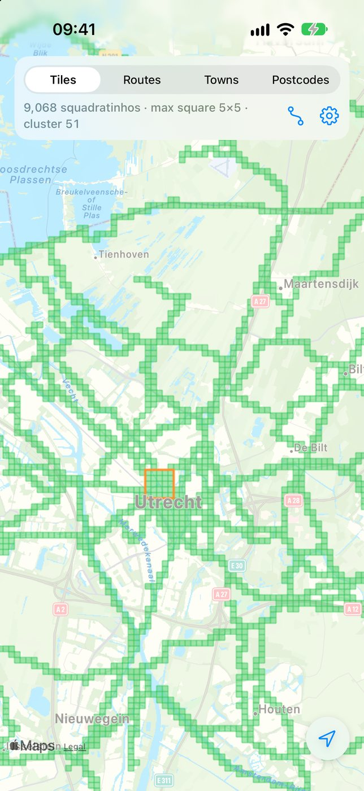
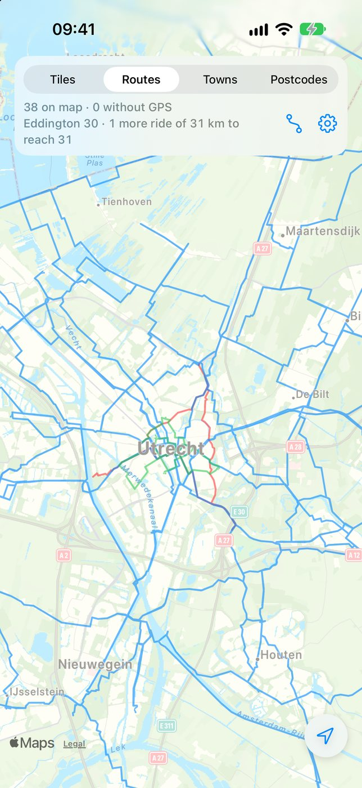

# Tileroam

[English](README.md) · [Nederlands](README.nl.md) · [Français](README.fr.md) · [Español](README.es.md) · **Deutsch**

Tileroam ist eine App für iPhone und iPad, die zeigt, wo du auf deinen Radtouren, Läufen und Wanderungen überall warst: jede Kartenkachel, Gemeinde und jedes Postleitzahlgebiet, das du besucht hast. Sie liest `.fit`-Dateien aus einem oder mehreren iCloud Drive-Ordnern (zum Beispiel Exporte aus HealthFit, Garmin oder Wahoo) und kann deinen Verlauf aus Strava importieren. Außerdem plant sie Radrouten zu Orten, an denen du noch nicht warst.


## Funktionen

- **Kacheln**: Kartenkacheln auf Zoom 14 (~1,5 km, wie bei VeloViewer, StatsHunters und [rideeverytile.com](https://rideeverytile.com/how-big-is-a-tile)) und *Squadratinhos* auf Zoom 17 (~190 m, wie bei Squadrats). Beide werden immer gezählt; du wählst, welche die Karte zeigt. Mit deinem **Max-Quadrat** und deinem **größten Cluster**.
- **Routen**: alle deine Aktivitäten auf einer Karte, nach Sportart eingefärbt.
- **Gemeinden und Postleitzahlen** in den Niederlanden, Belgien, Luxemburg und Deutschland, mit besucht/gesamt pro Land.
- **Routenplanung** in den Niederlanden, Belgien, Luxemburg und Deutschland: Tippe auf unbesuchte Kacheln, Gemeinden oder Postleitzahlen und Tileroam plant die kürzeste Rad-Rundtour durch alle. Sie startet an deinem Standort oder an einem **Startpunkt**, den du suchst oder auf der Karte gedrückt hältst (letzte Startpunkte werden gemerkt). Routen werden **auf dem Gerät** berechnet, daher funktioniert die Planung auch offline, sobald ein Gebiet geladen ist. Teile die Route als **GPX** oder speichere sie in deinem iCloud-Ordner. Du kannst auch eine vorhandene GPX öffnen, um zu sehen, welche neuen Orte sie bringen würde.
- **Strava**: Importiere deinen gesamten Verlauf mit GPS. Aktivitäten werden außerdem als Standard-`.fit`-Dateien in einem Ordner deiner Wahl gespeichert.
- **Doppelte zusammengeführt**: Dasselbe Training, von mehreren Geräten oder Apps aufgezeichnet (Uhr, Zwift, Strava, HealthFit), zählt nur einmal.
- **Widgets**: *Kacheln um dich herum* (eine Karte der Kacheln in deiner Nähe) und *Eddington-Zahl*, auf dem Home-Bildschirm und dem Sperrbildschirm.
- **Statistik**: besuchte Länder und Gemeinden, Eddington-Zahlen für Radfahren, Gehen und Laufen sowie Summen pro Sportart für dieses Jahr und insgesamt.
- **Indoor- und virtuelle Fahrten** (Zwift, Rouvy, MyWhoosh, Rollentrainer) zählen in der Statistik, bleiben aber von Karte, Kacheln, Gemeinden und Postleitzahlen fern.
- **Speicher ist optional**: Ohne gewählten Ordner speichert Tileroam Routen und Strava-Dateien im eigenen Speicher (Dateien-App › Auf meinem iPhone › Tileroam) und liest auch `.fit`-Dateien aus dem Ordner Import dort.
- **Einstellungen → Speicher** zeigt die geladenen Kartendaten und lässt dich sie entfernen. Kartendownloads über 25 MB warten auf WLAN, außer du erlaubst mobile Daten.
- **iPad**-Layout mit Seitenleiste, allen Ausrichtungen und Multitasking.
- Verfügbar auf **Englisch, Niederländisch, Französisch, Spanisch und Deutsch**.
- Die Karte öffnet sich auf deinem größten Cluster, dort, wo du am meisten fährst.

## Bildschirmfotos

| Kacheln (Zoom 14) | Squadratinhos (Zoom 17) | Routen | Gemeinden |
|---|---|---|---|
|  |  |  |  |

| Postleitzahlen | Routenplanung | Einstellungen | Einführung |
|---|---|---|---|
|  |  |  |  |

**iPad**

| Kacheln | Routenplanung |
|---|---|
|  |  |

*Die Bildschirmfotos zeigen generierte Demo-Fahrten rund um Utrecht, keine echten Aktivitäten.*

## Länder

| Land | Gemeinden | Postleitzahlen |
|---|---|---|
| Niederlande | 342 gemeenten | 4.071 (PC4) |
| Belgien | 565 | 1.150 |
| Luxemburg | 100 communes | – |
| Deutschland | 10.949 Gemeinden | 8.173 (PLZ) |

Kacheln, Routen und Statistiken funktionieren überall; Gemeinden, Postleitzahlen und Routenplanung decken diese vier Länder ab. Postleitzahlen sind nur dort enthalten, wo ihre Grenzen als offene Daten veröffentlicht sind. Die Grenzen eines Landes werden automatisch geladen, sobald du dort eine Aktivität hast.

## Erste Schritte

Voraussetzungen: Xcode 27 oder neuer, iOS/iPadOS 26 oder neuer und ein kostenpflichtiges Apple-Developer-Konto zum Signieren (nötig für iCloud und von Apple gehostete Asset Packs).

1. Klone das Repository und öffne `Tileroam.xcodeproj`.
2. Wähle für die Targets **Tileroam** und **TileroamWidget** dein Team unter *Signing & Capabilities*. Ändere den Bundle Identifier (`nl.petervanmanen.Tileroam`) und die App Group (`group.nl.petervanmanen.Tileroam`) auf deine eigenen.
3. Optional, für Strava: siehe unten.
4. Starte die App auf deinem iPhone oder iPad. Wähle beim ersten Start einen oder mehrere iCloud Drive-Ordner mit deinen `.fit`-Dateien. Ordner kannst du später unter *Einstellungen → Importordner* hinzufügen oder entfernen.

### Strava (optional)

Die Anmeldung läuft über die **Strava-App** (ein Tippen auf *Authorize*) oder, ohne Strava-App, über die Web-Anmeldung von Strava. Das Client Secret liegt auf einem kleinen **Token-Dienst** ([`backend/strava-auth`](backend/strava-auth), ein Cloudflare Worker); die App enthält nur die Client ID.

1. Lege unter [strava.com/settings/api](https://www.strava.com/settings/api) eine API-Anwendung mit `localhost` als *Authorization Callback Domain* an.
2. Richte den Token-Dienst ein, wie in [`backend/strava-auth/README.md`](backend/strava-auth/README.md) beschrieben.
3. Kopiere `StravaConfig.example.plist` nach `Tileroam/StravaConfig.plist` und trage `ClientID` ein. Sie ist nicht geheim; die Datei steht in `.gitignore`, weil sie deine eigene Konfiguration ist. Die Adresse des Tokendienstes ist `StravaServiceURL` in `Tileroam/Servers.plist`, der einen Datei mit den Servern der App (auch den Kacheln für die Routenplanung); trage dort die URL deines Workers ein.
4. Baue und starte die App und tippe auf *Connect with Strava*.

Das Client Secret liegt nur im Token-Dienst, nie in der App. Strava ist über die Kompilierbedingung `STRAVA` in Debug- und Release-Builds enthalten; entferne sie aus den *Active Compilation Conditions*, um ohne Strava zu bauen. Für andere Nutzer muss Strava zuerst das Athletenlimit deiner Anwendung erhöhen (standardmäßig ein Athlet).

Strava erlaubt etwa 100 Anfragen pro 15 Minuten und 1.000 pro Tag. Die Aktivitätenliste kommt schnell mit vereinfachten Strecken; detailliertes GPS wird danach ergänzt, und die Synchronisierung läuft automatisch weiter.

## So funktioniert es

- **FIT-Dateien** werden von einem kleinen eingebauten Decoder gelesen (`FIT/FITDecoder.swift`). Strecken, Kacheln und besuchte Gebiete werden zwischengespeichert, sodass beim nächsten Start nur neue oder geänderte Dateien gelesen werden.
- **Kacheln** verwenden die Standardformel für Web-Mercator-Kacheln (`Geo/TileGrid.swift`). Max-Quadrat und Cluster werden nur über die besuchten Kacheln berechnet und bleiben so auch für Zoom-17-Kacheln quer durch Europa schnell.
- **Doppelte**: Aktivitäten derselben Art, die sich zeitlich überschneiden, werden zusammengeführt (`Import/ActivityMerge.swift`); die Kopie mit dem besten GPS und der längsten Distanz bleibt erhalten.
- **Gemeinden und Postleitzahlen** sind kompakte Binärdateien (`AssetPacks/Regions/*.fmr`, insgesamt 6,3 MB) mit einem räumlichen Index für schnelle Abfragen. Sie sind nicht in der App: Jedes Land ist ein von Apple gehostetes Asset Pack (`regions-NL`, …), das die App mit Background Assets lädt, sobald du dort eine Aktivität hast. `Tools/build_asset_packs.sh` erstellt die Packs für App Store Connect; im Simulator liest `-RegionsDir <repo>/AssetPacks/Regions` sie direkt.
- Die **Routenplanung** läuft auf dem Gerät mit [Valhalla](https://github.com/valhalla/valhalla), über [valhalla-mobile](https://github.com/Rallista/valhalla-mobile), und OpenStreetMap-Kacheln für die Niederlande, Belgien, Luxemburg und Deutschland. Die Kacheln liegen auf Cloudflare R2; ein Plan lädt nur die Valhalla-Kacheln in seiner Umgebung (25–75 MB statt 2,2 GB für alles). Downloads über 25 MB warten auf WLAN (`MapDataDownloads`). Die Reihenfolge wird auf Luftlinien-Entfernungen bestimmt (`TripSolver`, viel schneller als eine Routing-Matrix auf dem Gerät); danach wählt der Planer in jedem Ziel den Punkt mit dem kleinsten Umweg, und Valhalla berechnet die Rundtour. Kacheln bauen und hochladen, Länder hinzufügen: [docs/ROUTING.md](docs/ROUTING.md).

## Grenzdaten

Die Grenzdateien werden von `Tools/build_regions.py` aus den offenen Datenquellen erzeugt, die unter *Einstellungen → Quellen und Lizenzen* aufgeführt sind:

```bash
python3 -m venv venv && venv/bin/pip install pyshp pyproj shapely
venv/bin/python Tools/build_regions.py <download-ordner> AssetPacks/Regions
```

Das Skript dokumentiert, woher jede Quelldatei stammt. Es projiziert nach WGS84 um, führt Teile pro Code zusammen, vereinfacht die Grenzen auf ~25 m (Gemeinden) bzw. ~20 m (Postleitzahlen) und schreibt das kompakte Format.

| Land | Quelle und Lizenz |
|---|---|
| Niederlande | CBS / Kadaster über PDOK (CC BY 4.0) |
| Belgien | NGI-IGN, bpost über Opendatasoft (Postleitzahl-Lizenz: siehe Quelle) |
| Luxemburg | ACT (CC0) |
| Deutschland | BKG VG250 (dl-de/by-2-0); Postleitzahlen: OpenStreetMap (ODbL) |

Routenplanung: © OpenStreetMap-Mitwirkende (ODbL), Routing durch Valhalla auf dem Gerät.

## Dokumentation

- [Benutzerhandbuch](docs/MANUAL.md) (Englisch)
- [Support und FAQ](SUPPORT.md) (Englisch)
- [App-Store-Paket](docs/appstore/README.md): Metadaten, Screenshots, Datenschutzangaben, Hinweise für die Prüfung

## Projektstruktur

```
Tileroam/
  FIT/          FIT-Decoder und -Encoder
  Geo/          Kacheln, Gemeinden/Postleitzahlen, Eddington, Vereinfachung
  Import/       Ordnerzugriff, Import, Cache, Zusammenführen von Duplikaten, ActivityStore
  Map/          MKMapView-Wrapper und Overlays (Kacheln, Gebiete, Routen)
  Planning/     Routenplanung (Valhalla auf dem Gerät), Routingdaten, Startpunkte, GPX, Abdeckung
  Strava/       Strava-API-Client, Webhook-Ereignisse, Export als .fit
  Views/        SwiftUI-Bildschirme (Karte, Einstellungen, Speicher, Einführung, Planungsbereich)
TileroamAssets/   Background-Assets-Downloader-Erweiterung
TileroamWidget/   Widgets: Kacheln um dich herum, Eddington-Zahl
TileroamTests/    Unit-Tests (Swift Testing)
AssetPacks/       Grenzen von Gemeinden und Postleitzahlen, als Asset Packs
backend/          Strava-Tokendienst und Warteschlange für Webhook-Ereignisse (Cloudflare Worker)
Tools/            Skripte für Daten, Routing, Asset Packs, Screenshots und Releases
```

## Tests

```bash
xcodebuild test -project Tileroam.xcodeproj -scheme Tileroam -destination 'platform=iOS Simulator,name=iPhone 18 Pro'
```

## Einschränkungen

- Gemeinden, Postleitzahlen und Routenplanung decken nur die Niederlande, Belgien, Luxemburg und Deutschland ab. [docs/ROUTING.md](docs/ROUTING.md) beschreibt, wie man Länder hinzufügt.
- Luxemburg hat keine offenen Postleitzahlgrenzen.
- Routen sind Rundtouren; einfache Strecken von A nach B werden noch nicht unterstützt.

## Datenschutz

Tileroam hat keine Konten, keine Analysewerkzeuge und kein Tracking. Deine Aktivitäten, Kacheln und Statistiken bleiben auf deinem Gerät und in deiner eigenen iCloud, und die Routenplanung läuft auf dem Gerät. Strava-Tokens liegen im Schlüsselbund. Die Server sind der Strava-Tokendienst ([`backend/strava-auth`](backend/strava-auth)): Er tauscht den Anmeldecode, ohne Tokens zu speichern, und bewahrt die Webhook-Ereignisse von Strava auf (Athleten- und Aktivitätsnummern, höchstens 30 Tage), damit die App Aktivitäten löschen kann, die du auf Strava gelöscht hast, und die Kartendaten für die Routenplanung auf Cloudflare R2, die nichts protokolliert. Siehe die [Datenschutzerklärung](PRIVACY.md) (Englisch).

## Lizenz

Der Quellcode steht unter der [MIT-Lizenz](LICENSE). Die Grenzdaten behalten die Lizenzen ihrer Quellen (CC BY 4.0, CC0, dl-de/by-2-0, ODbL sowie die Lizenzen von NGI und bpost), und die Routingdaten sind © OpenStreetMap-Mitwirkende (ODbL); siehe [DATA-LICENSES.md](DATA-LICENSES.md).
