# Tileroam

[English](README.md) · **Nederlands** · [Français](README.fr.md) · [Español](README.es.md) · [Deutsch](README.de.md)

Tileroam is een app voor iPhone en iPad die laat zien waar je allemaal bent geweest tijdens je fietsritten, hardlooprondes en wandelingen: elke kaarttegel, gemeente en elk postcodegebied dat je hebt bezocht. De app leest `.fit`-bestanden uit een of meer iCloud Drive-mappen (bijvoorbeeld exports van HealthFit, Garmin of Wahoo) en kan je geschiedenis uit Strava importeren. Daarnaast plant Tileroam fietsroutes naar plekken waar je nog niet bent geweest.

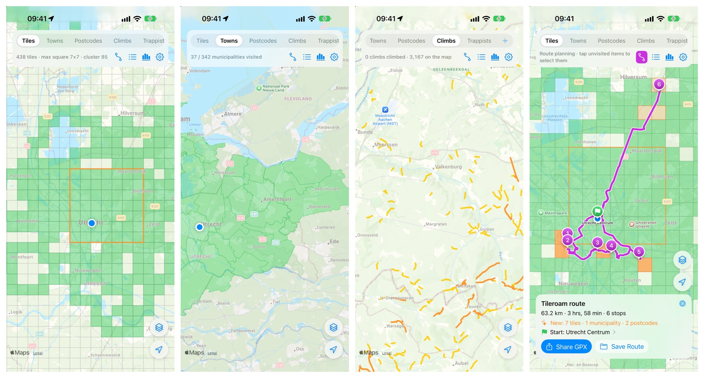

## Functies

- **Tegels**: kaarttegels op zoom 14 (~1,5 km, zoals bij VeloViewer, StatsHunters en [rideeverytile.com](https://rideeverytile.com/how-big-is-a-tile)) Inclusief je **max. vierkant** en **grootste cluster**.
- **Klimmen**: elke klim op de wegen (Cat. 4 tot HC zoals op Strava, en korte steile heuvels), gevonden uit hoogtegegevens; welke je hebt beklommen, op een eigen kaarttab en in Statistieken, en klimmen om mee te nemen bij het plannen van een route. Zie [docs/CLIMBS.md](docs/CLIMBS.md).
- **Uitdagingen**: naast tegels zet je met de **+** boven aan de kaart de uitdagingen aan die je wilt: gemeenten, postcodes, klimmen en de **Trappistenuitdaging** (fiets langs de trappistenbrouwerijen; binnen 200 m telt). Verborgen uitdagingen tellen gewoon mee.
- **Badges**: 18 badges, van *100!*, *Century* en *Everester* tot *Festive 500*, *Triatleet* en *Wereldreiziger* (50 landen, op het apparaat bepaald). Verdiende badges staan in kleur, met hoe vaak; indooractiviteiten tellen ook.
- **Activiteiten**: een lijst van alle activiteiten, nieuwste eerst, met duur, afstand en gemiddeld vermogen (met een vermogensmeter) of gemiddelde snelheid.
- **Gemeenten en postcodes** in Nederland, België, Luxemburg, Duitsland, Frankrijk, Zwitserland en Oostenrijk, met bezocht/totaal per land.
- **Routeplanning** in Nederland, België, Luxemburg, Duitsland, Frankrijk, Zwitserland en Oostenrijk: tik op onbezochte tegels, gemeenten of postcodes en Tileroam plant de kortste fietsrondrit langs al die plekken. Hij start vanaf je locatie, of vanaf een **startpunt** dat je zoekt of op de kaart ingedrukt houdt (recente startpunten worden onthouden). Routes worden **op het apparaat** berekend, dus plannen werkt ook offline zodra een gebied is gedownload. Deel de route als **GPX** of bewaar hem in je iCloud-map. Je kunt ook een bestaande GPX openen om te zien welke nieuwe plekken die oplevert.
- **Strava**: importeer je volledige geschiedenis met gps. Activiteiten worden ook als standaard `.fit`-bestanden bewaard in een map naar keuze.
- **Dubbele activiteiten samengevoegd**: dezelfde training die door meerdere apparaten of apps is vastgelegd (horloge, Zwift, Strava, HealthFit) telt één keer.
- **Widgets**: *Tegels om je heen* (een kaart van de tegels bij jou in de buurt) en *Eddington-getal*, op het beginscherm en toegangsscherm.
- **Statistieken**: bezochte landen en gemeenten, Eddington-getallen voor fietsen, wandelen en hardlopen, en totalen per sport voor dit jaar en in totaal.
- **Binnen- en virtuele ritten** (Zwift, Rouvy, MyWhoosh, trainerritten) tellen mee in de statistieken maar blijven van de kaart, tegels, gemeenten en postcodes.
- **Je eigen kopie, gesynchroniseerd met iCloud**: geïmporteerde `.fit`-bestanden en Strava-downloads worden in de app bewaard (Bestanden-app › Op mijn iPhone › Tileroam › Activities), en met iCloud-synchronisatie ook in iCloud Drive › Tileroam, zonder dubbelen; een volgend apparaat hoeft niets in te stellen. Importeren is een eenmalige kopie. Activiteiten kun je verwijderen in de lijst Activiteiten.
- **Instellingen → Opslag** toont de gedownloade kaartgegevens en laat je ze verwijderen. Kaartdownloads groter dan 25 MB wachten op wifi, tenzij je mobiele data toestaat.
- **iPad**-weergave met zijpaneel, alle oriëntaties en multitasking.
- Beschikbaar in het **Engels, Nederlands, Frans, Spaans en Duits**.
- De kaart opent op je grootste cluster, zodat je begint waar je het meest rijdt.

## Schermafbeeldingen

| Tegels | Gemeenten | Postcodes |
|---|---|---|
| 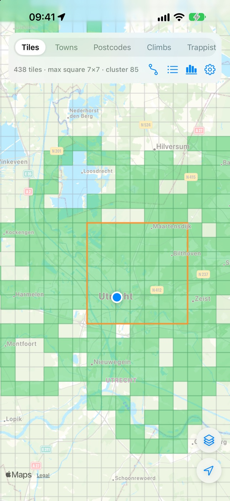 | 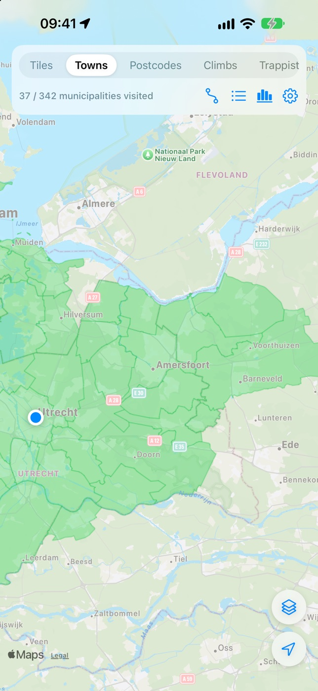 | 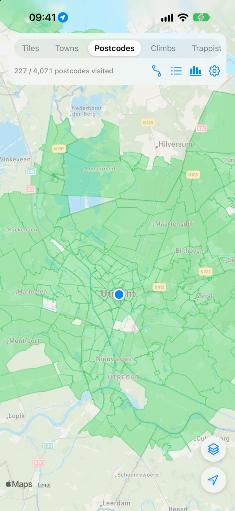 |

| Klimmen | Trappistenuitdaging | Routeplanning |
|---|---|---|
| 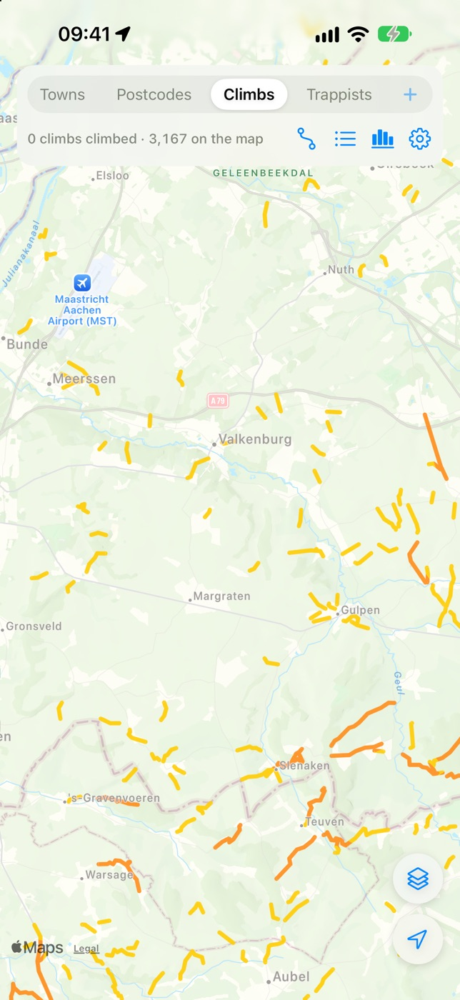 | 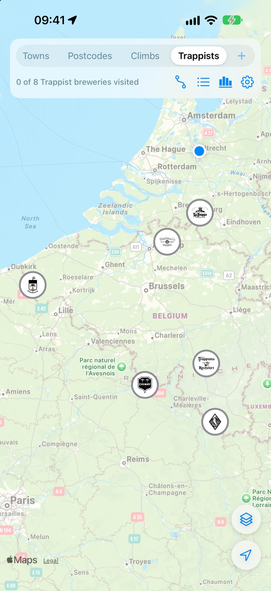 | 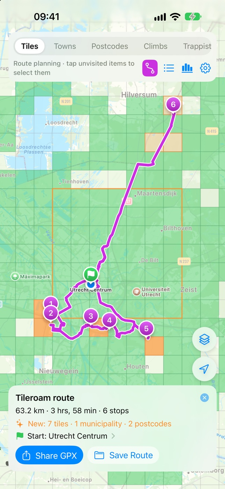 |

| Badges | Instellingen | Introductie |
|---|---|---|
| 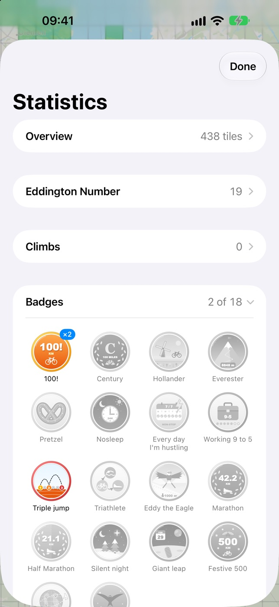 | 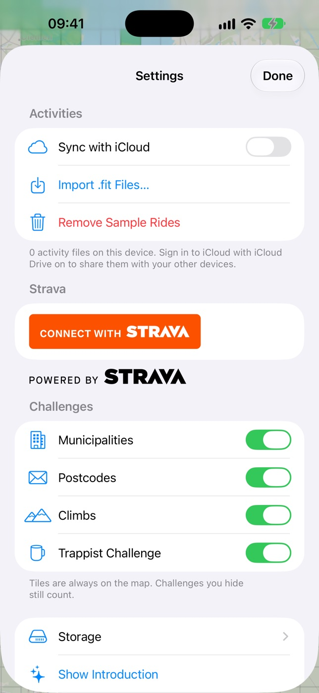 | 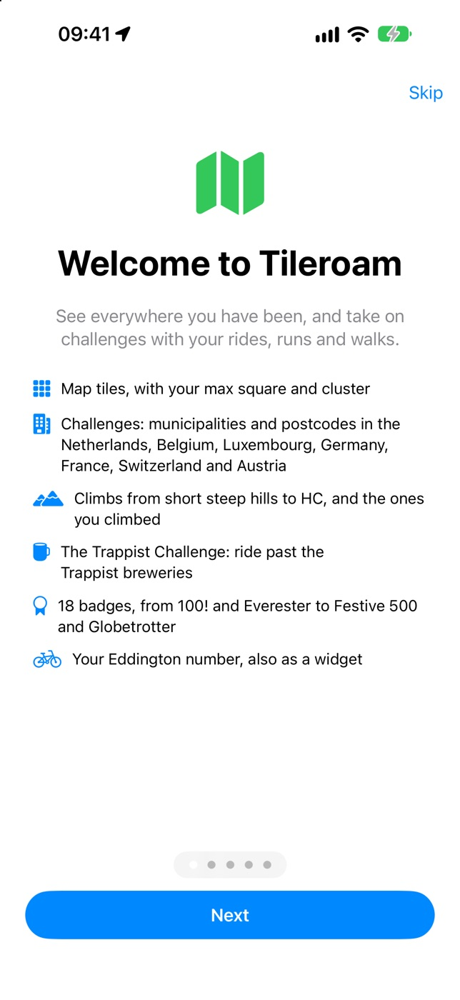 |

**iPad**

| Tegels | Routeplanning |
|---|---|
| 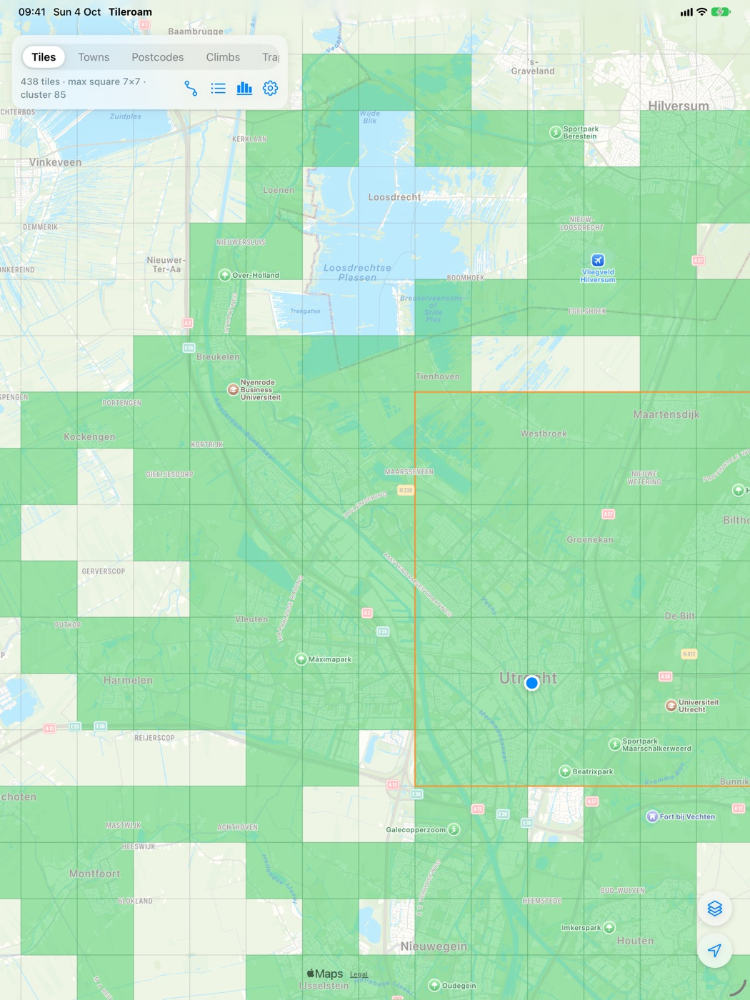 | 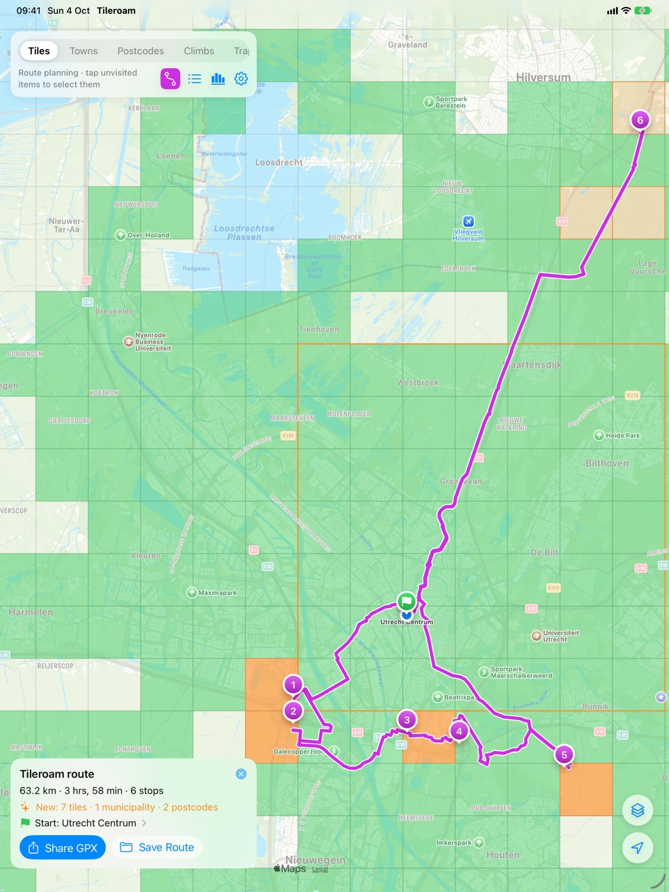 |

*De schermafbeeldingen gebruiken gegenereerde demoritten rond Utrecht, geen echte activiteiten.*

## Landen

| Land | Gemeenten | Postcodes |
|---|---|---|
| Nederland | 342 gemeenten | 4.071 (PC4) |
| België | 565 | 1.150 |
| Luxemburg | 100 communes | – |
| Duitsland | 10.949 Gemeinden | 8.173 (PLZ) |
| Frankrijk | 34.888 communes | 6.158 (benaderde zones) |
| Zwitserland | 2.128 Gemeinden | 3.181 PLZ |
| Oostenrijk | 2.092 Gemeinden | – |

Tegels, routes en statistieken werken overal; gemeenten, postcodes en routeplanning dekken deze zeven landen. Postcodes zijn alleen opgenomen waar de grenzen als open data beschikbaar zijn. De grenzen van een land worden automatisch gedownload zodra je er een activiteit hebt.

## Aan de slag

Vereisten: Xcode 27 of nieuwer, iOS/iPadOS 26 of nieuwer, en een betaald Apple Developer-account om te ondertekenen (nodig voor iCloud en door Apple gehoste asset packs).

1. Clone de repository en open `Tileroam.xcodeproj`.
2. Kies bij de targets **Tileroam** en **TileroamWidget** je team onder *Signing & Capabilities*. Verander de bundle identifier (`nl.petervanmanen.Tileroam`) en de App Group (`group.nl.petervanmanen.Tileroam`) naar je eigen waarden.
3. Optioneel, voor Strava: zie hieronder.
4. Start de app op je iPhone of iPad. Importeer bij de eerste start `.fit`-bestanden (of een map ermee), koppel Strava of probeer de voorbeeldritten. Later importeer je meer via *Instellingen → Activiteiten*.

### Strava (optioneel)

Inloggen gaat via de **Strava-app** (één tik op *Authorize*) of, zonder Strava-app, via de webinlog van Strava. Het Client Secret staat op een kleine **tokenservice** ([`backend/strava-auth`](backend/strava-auth), een Cloudflare Worker); de app zelf bevat alleen de Client ID.

1. Maak een API-applicatie op [strava.com/settings/api](https://www.strava.com/settings/api) met als *Authorization Callback Domain* `localhost`.
2. Zet de tokenservice live zoals beschreven in [`backend/strava-auth/README.md`](backend/strava-auth/README.md).
3. Kopieer `StravaConfig.example.plist` naar `Tileroam/StravaConfig.plist` en vul `ClientID` in. Die is niet geheim; het bestand staat in `.gitignore` omdat het je eigen configuratie is. Het adres van de tokenservice is `StravaServiceURL` in `Tileroam/Servers.plist`, het ene bestand met de servers van de app (ook de tegels voor routeplanning); zet daar de URL van je Worker.
4. Bouw en start de app en tik op *Connect with Strava*.

Het Client Secret staat alleen in de tokenservice, nooit in de app. Strava zit in Debug- en Release-builds via de compilatievoorwaarde `STRAVA`; haal die weg uit *Active Compilation Conditions* om zonder Strava te bouwen. Voor andere gebruikers moet Strava eerst de sporterlimiet van je applicatie verhogen (standaard één sporter).

Strava staat ongeveer 100 verzoeken per 15 minuten en 1.000 per dag toe. De activiteitenlijst komt snel binnen met vereenvoudigde routes; gedetailleerde gps wordt daarna aangevuld en de synchronisatie gaat automatisch verder.

## Hoe het werkt

- **FIT-bestanden** worden gelezen door een kleine ingebouwde decoder (`FIT/FITDecoder.swift`). Routes, tegels en bezochte gebieden worden bewaard in een cache, zodat bij de volgende start alleen nieuwe of gewijzigde bestanden worden gelezen.
- **Opslag** (`Import/Library.swift`): elke activiteit en route staat in de app (`Documents/Activities`, `Documents/Routes`). Met iCloud-synchronisatie spiegelen `Library.pull`/`push` ze naar iCloud Drive › Tileroam, nadat dubbele bestanden zijn verwijderd (`ActivityMerge.preferredFile`). Verwijderde activiteiten worden onthouden in de key-value-opslag van iCloud (`Deletions`), zodat andere apparaten hun kopie verwijderen en Strava ze niet terugbrengt. De mappen van eerdere versies worden eenmalig gekopieerd (`Library.migrate`).
- **Tegels** gebruiken de standaard Web Mercator-tegelformule (`Geo/TileGrid.swift`). Max. vierkant en cluster worden alleen over de bezochte tegels berekend, zodat dat ook bij veel tegels snel blijft.
- **Dubbelen**: activiteiten van hetzelfde soort die in de tijd overlappen worden samengevoegd (`Import/ActivityMerge.swift`); de kopie met de beste gps en de langste afstand blijft over.
- **Gemeenten en postcodes** zijn compacte binaire bestanden (`AssetPacks/Regions/*.fmr`, samen 6,3 MB) met een ruimtelijke index voor snelle opzoekingen. Ze zitten niet in de app: elk land is een door Apple gehost asset pack (`regions-NL`, …) dat de app met Background Assets downloadt zodra je er een activiteit hebt. `Tools/build_asset_packs.sh` maakt de packs voor App Store Connect; in de simulator leest `-RegionsDir <repo>/AssetPacks/Regions` ze rechtstreeks.
- **Routeplanning** draait op het apparaat met [Valhalla](https://github.com/valhalla/valhalla), via [valhalla-mobile](https://github.com/Rallista/valhalla-mobile), en OpenStreetMap-tegels voor Nederland, België, Luxemburg, Duitsland, Frankrijk, Zwitserland en Oostenrijk. De tegels staan op Cloudflare R2; een plan downloadt alleen de Valhalla-tegels eromheen (25–75 MB, in plaats van 2,2 GB voor alles). Downloads groter dan 25 MB wachten op wifi (`MapDataDownloads`). De volgorde wordt bepaald op hemelsbrede afstanden (`TripSolver`, veel sneller dan een routematrix op het apparaat); daarna kiest de planner binnen elk doel het punt dat de omweg het kleinst houdt, en Valhalla berekent de rondrit. Hoe je de tegels bouwt en uploadt en landen toevoegt: [docs/ROUTING.md](docs/ROUTING.md).

## Grensdata

De grensbestanden worden gemaakt door `Tools/build_regions.py` uit de open databronnen die in *Instellingen → Bronnen en licenties* staan:

```bash
python3 -m venv venv && venv/bin/pip install pyshp pyproj shapely
venv/bin/python Tools/build_regions.py <download-map> AssetPacks/Regions
```

Het script beschrijft waar elk bronbestand vandaan komt. Het herprojecteert naar WGS84, voegt delen per code samen, vereenvoudigt de grenzen tot ~25 m (gemeenten) of ~20 m (postcodes) en schrijft het compacte formaat.

| Land | Bron en licentie |
|---|---|
| Nederland | CBS / Kadaster via PDOK (CC BY 4.0) |
| België | NGI-IGN, bpost via Opendatasoft (postcodelicentie: zie bron) |
| Luxemburg | ACT (CC0) |
| Duitsland | BKG VG250 (dl-de/by-2-0); postcodes: OpenStreetMap (ODbL) |
| Frankrijk | IGN, INSEE; postcodezones Etalab / BAN (Licence Ouverte 2.0) |
| Zwitserland | swisstopo (opendata.swiss) |
| Oostenrijk | Statistik Austria (CC BY 4.0) |

Routeplanning: © OpenStreetMap-bijdragers (ODbL), routering door Valhalla op het apparaat.

## Documentatie

- [Gebruikershandleiding](docs/MANUAL.md) (Engels)
- [Ondersteuning en veelgestelde vragen](SUPPORT.md) (Engels)
- [App Store-pakket](docs/appstore/README.md): metadata, schermafbeeldingen, privacyantwoorden, notities voor de review

## Projectstructuur

```
Tileroam/
  FIT/          FIT-decoder en -encoder
  Geo/          tegels, gemeenten/postcodes, Eddington, vereenvoudiging
  Import/       maptoegang, import, cache, samenvoegen, ActivityStore
  Map/          MKMapView-wrapper en overlays (tegels, gebieden, routes)
  Planning/     routeplanning (Valhalla op het apparaat), routeringsdata, startpunten, GPX, dekking
  Strava/       Strava-API-client, webhook-meldingen, export naar .fit
  Views/        SwiftUI-schermen (kaart, instellingen, opslag, introductie, planpaneel)
TileroamAssets/   Background Assets-downloadextensie
TileroamWidget/   widgets: Tegels om je heen, Eddington-getal
TileroamTests/    unittests (Swift Testing)
AssetPacks/       grenzen van gemeenten en postcodes, als asset packs
backend/          Strava-tokenservice en wachtrij voor webhook-meldingen (Cloudflare Worker)
Tools/            scripts voor data, routering, asset packs, schermafbeeldingen en releases
```

## Tests

```bash
xcodebuild test -project Tileroam.xcodeproj -scheme Tileroam -destination 'platform=iOS Simulator,name=iPhone 18 Pro'
```

## Beperkingen

- Gemeenten, postcodes en routeplanning dekken alleen Nederland, België, Luxemburg, Duitsland, Frankrijk, Zwitserland en Oostenrijk. [docs/ROUTING.md](docs/ROUTING.md) beschrijft hoe je landen toevoegt.
- Luxemburg heeft geen open postcodegrenzen.
- Routes zijn rondritten; enkele routes van A naar B worden nog niet ondersteund.

## Privacy

Tileroam heeft geen accounts, analytics of tracking. Je activiteiten, tegels en statistieken blijven op je apparaat en in je eigen iCloud, en routeplanning draait op het apparaat. Strava-tokens worden in de sleutelhanger bewaard. De servers zijn de Strava-tokenservice ([`backend/strava-auth`](backend/strava-auth)): die wisselt de inlogcode om zonder tokens te bewaren, en houdt de webhook-meldingen van Strava bij (sporter- en activiteitnummers, hoogstens 30 dagen), zodat de app activiteiten kan verwijderen die je op Strava hebt verwijderd, en de kaartgegevens voor routeplanning op Cloudflare R2, die niets logt. Zie het [privacybeleid](PRIVACY.md) (Engels).

## Licentie

De broncode valt onder de [MIT-licentie](LICENSE). De grensdata houdt de licenties van de bronnen (CC BY 4.0, CC0, dl-de/by-2-0, ODbL en de licenties van NGI en bpost), en de routeringsdata is © OpenStreetMap-bijdragers (ODbL); zie [DATA-LICENSES.md](DATA-LICENSES.md).
